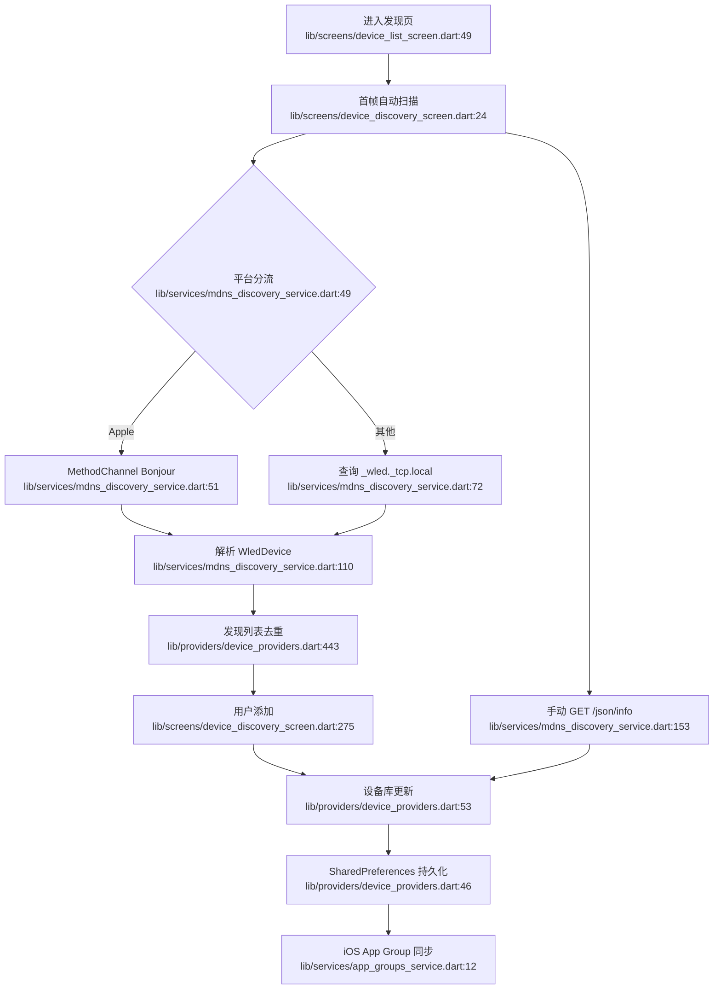

# 设备发现与设备库

```mermaid
flowchart TD
    A["进入发现页<br/>lib/screens/device_list_screen.dart:49"] --> B["首帧自动扫描<br/>lib/screens/device_discovery_screen.dart:24"]
    B --> C{"平台分流<br/>lib/services/mdns_discovery_service.dart:49"}
    C -->|Apple| D["MethodChannel Bonjour<br/>lib/services/mdns_discovery_service.dart:51"]
    C -->|其他| E["查询 _wled._tcp.local<br/>lib/services/mdns_discovery_service.dart:72"]
    D --> F["解析 WledDevice<br/>lib/services/mdns_discovery_service.dart:110"]
    E --> F
    F --> G["发现列表去重<br/>lib/providers/device_providers.dart:443"]
    G --> H["用户添加<br/>lib/screens/device_discovery_screen.dart:275"]
    H --> I["设备库更新<br/>lib/providers/device_providers.dart:53"]
    I --> J["SharedPreferences 持久化<br/>lib/providers/device_providers.dart:46"]
    J --> K["iOS App Group 同步<br/>lib/services/app_groups_service.dart:12"]
    B --> L["手动 GET /json/info<br/>lib/services/mdns_discovery_service.dart:153"]
    L --> I
```

副作用：mDNS、MethodChannel、HTTP 验证、SharedPreferences、App Group。读取失败保留空设备库；扫描异常主要记录日志。
