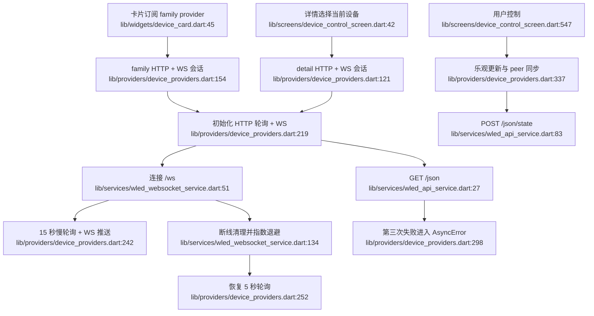

# 单设备实时会话与通信

```mermaid
flowchart TD
    A["卡片订阅 family provider<br/>lib/widgets/device_card.dart:45"] --> C["family HTTP + WS 会话<br/>lib/providers/device_providers.dart:154"]
    B["详情选择当前设备<br/>lib/screens/device_control_screen.dart:42"] --> D["detail HTTP + WS 会话<br/>lib/providers/device_providers.dart:121"]
    C --> E["初始化 HTTP 轮询 + WS<br/>lib/providers/device_providers.dart:219"]
    D --> E
    E --> F["GET /json<br/>lib/services/wled_api_service.dart:27"]
    E --> G["连接 /ws<br/>lib/services/wled_websocket_service.dart:51"]
    G --> H["15 秒慢轮询 + WS 推送<br/>lib/providers/device_providers.dart:242"]
    I["用户控制<br/>lib/screens/device_control_screen.dart:547"] --> J["乐观更新与 peer 同步<br/>lib/providers/device_providers.dart:337"]
    J --> K["POST /json/state<br/>lib/services/wled_api_service.dart:83"]
    G --> L["断线清理并指数退避<br/>lib/services/wled_websocket_service.dart:134"]
    L --> M["恢复 5 秒轮询<br/>lib/providers/device_providers.dart:252"]
    F --> N["第三次失败进入 AsyncError<br/>lib/providers/device_providers.dart:298"]
```

关键事实：同一设备可同时存在 family 与 detail 两套完整会话；控制走 HTTP，WS 仅收状态与保活；UDP 当前无调用方。
