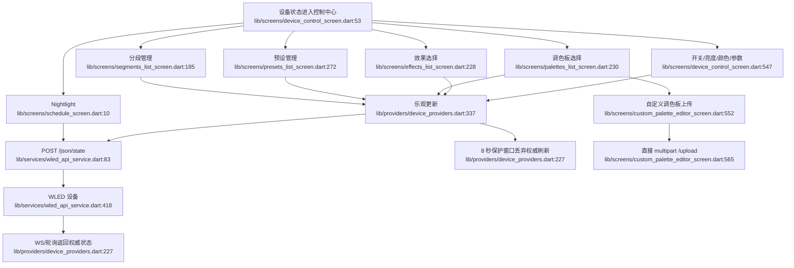

# 灯光能力控制

```mermaid
flowchart TD
    A["设备状态进入控制中心<br/>lib/screens/device_control_screen.dart:53"] --> B["开关/亮度/颜色/参数<br/>lib/screens/device_control_screen.dart:547"]
    A --> C["效果选择<br/>lib/screens/effects_list_screen.dart:228"]
    A --> D["调色板选择<br/>lib/screens/palettes_list_screen.dart:230"]
    A --> E["预设管理<br/>lib/screens/presets_list_screen.dart:272"]
    A --> F["分段管理<br/>lib/screens/segments_list_screen.dart:185"]
    A --> G["Nightlight<br/>lib/screens/schedule_screen.dart:10"]
    B --> H["乐观更新<br/>lib/providers/device_providers.dart:337"]
    C --> H
    D --> H
    E --> H
    F --> H
    H --> I["POST /json/state<br/>lib/services/wled_api_service.dart:83"]
    G --> I
    I --> J["WLED 设备<br/>lib/services/wled_api_service.dart:418"]
    J --> K["WS/轮询返回权威状态<br/>lib/providers/device_providers.dart:227"]
    H --> L["8 秒保护窗口丢弃权威刷新<br/>lib/providers/device_providers.dart:227"]
    D --> M["自定义调色板上传<br/>lib/screens/custom_palette_editor_screen.dart:552"]
    M --> N["直接 multipart /upload<br/>lib/screens/custom_palette_editor_screen.dart:565"]
```

关键事实：主要灯光写入共享同一乐观更新器，但 Nightlight、预设保存/删除和自定义调色板上传绕过该链路；主分段读取与写入语义不一致；多处异步调用未等待或无失败反馈。
