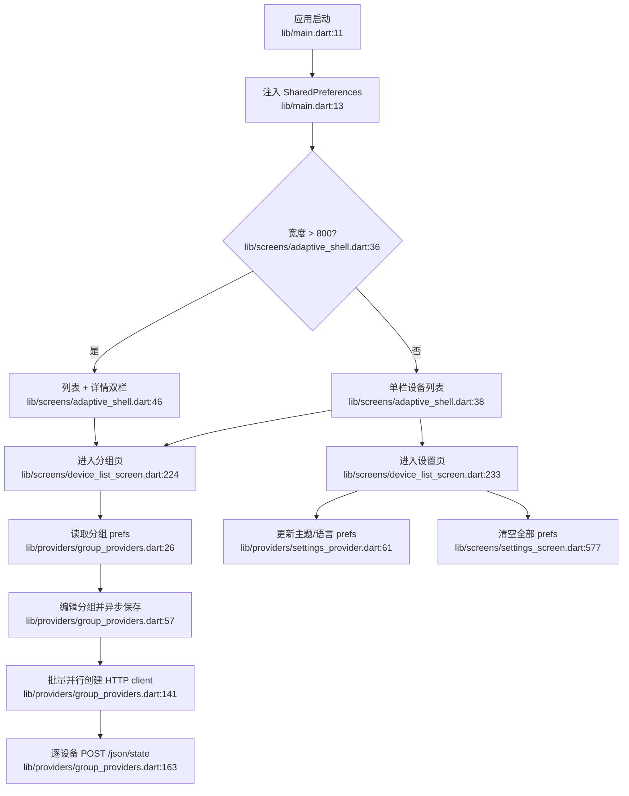

# 多设备与应用壳

```mermaid
flowchart TD
    A["应用启动<br/>lib/main.dart:11"] --> B["注入 SharedPreferences<br/>lib/main.dart:13"]
    B --> C{"宽度 > 800?<br/>lib/screens/adaptive_shell.dart:36"}
    C -->|否| D["单栏设备列表<br/>lib/screens/adaptive_shell.dart:38"]
    C -->|是| E["列表 + 详情双栏<br/>lib/screens/adaptive_shell.dart:46"]
    D --> F["进入分组页<br/>lib/screens/device_list_screen.dart:224"]
    E --> F
    F --> G["读取分组 prefs<br/>lib/providers/group_providers.dart:26"]
    G --> H["编辑分组并异步保存<br/>lib/providers/group_providers.dart:57"]
    H --> I["批量并行创建 HTTP client<br/>lib/providers/group_providers.dart:141"]
    I --> J["逐设备 POST /json/state<br/>lib/providers/group_providers.dart:163"]
    D --> K["进入设置页<br/>lib/screens/device_list_screen.dart:233"]
    K --> L["更新主题/语言 prefs<br/>lib/providers/settings_provider.dart:61"]
    K --> M["清空全部 prefs<br/>lib/screens/settings_screen.dart:577"]
```

副作用：分组与设置持久化、批量 HTTP 请求、外部 URL、全量偏好清理。宽屏壳与左右子页面分别创建背景层。
