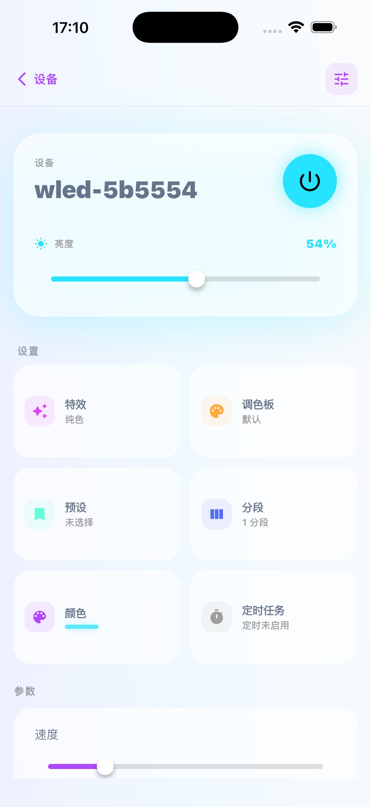
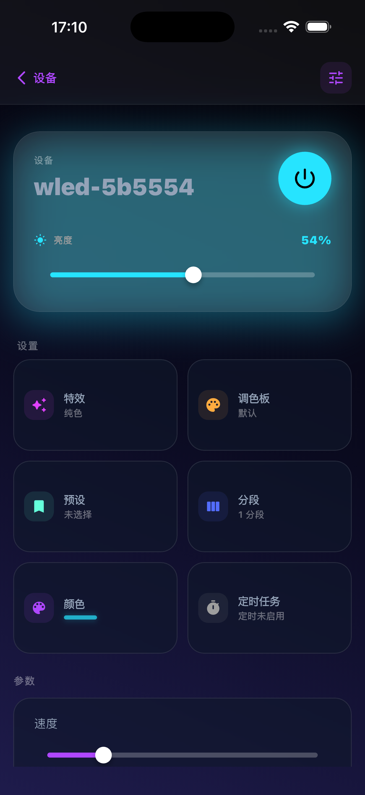

# W-Link - Modern WLED Controller

**[🇨🇳 中文](README.md) | 🇺🇸 English**

W-Link is a modern, minimalist WLED device control app built with Flutter. It aims to provide a smooth, intuitive user experience, making WLED LED strip management simple and elegant. *(Note: This project was developed with AI assistance, for learning and reference purposes)*

🌐 **Official Website**: [https://ainx.ink/](https://ainx.ink/)
🍎 **iOS**: Available on the App Store, please visit the official website for the link.
🤖 **Android**: Download the APK from GitHub Releases.

## ✨ Features

* **Auto Discovery**: Automatically discover WLED devices on your local network via mDNS, zero configuration required.
* **Real-time Control**: Millisecond-level response for power, brightness, and color adjustments.
* **Optimistic UI**: Instant feedback on interactions, ignoring network latency for a silky smooth experience.
* **Modern Design**: Glassmorphism design with delicate micro-interactions powered by `flutter_animate`.
* **Dark Mode**: Perfect adaptation to iOS/Android system-level dark/light theme switching.
* **Defensive Programming**: Retry mechanisms and graceful degradation optimized for network fluctuations.

## 🛠 Tech Stack

* **Framework**: Flutter 3.10+ (Dart 3.0)
* **State Management**: [Riverpod 2.6](https://riverpod.dev/) (Annotation-based)
* **Networking**: HTTP (with Keep-Alive & Timeout handling)
* **UI Components**:
  * `flutter_animate`: Declarative animations
  * `flex_color_picker`: Professional color picker
  * `cupertino_icons`: iOS-style icons
* **Architecture**:
  * Feature-first layered architecture
  * Code Generation (`riverpod_generator`, `json_serializable`)

## 📸 Screenshots

| Light Mode                                 | Dark Mode                                |
| :----------------------------------------: | :--------------------------------------: |
|   |   |

## 🚀 Getting Started

### Prerequisites

* Flutter SDK >= 3.10.0
* Dart SDK >= 3.0.0

### Installation

1. **Clone the repository**

    ```bash
    git clone https://github.com/fkueyu/W-Link.git
    cd W-Link
    ```

2. **Install dependencies**

    ```bash
    flutter pub get
    ```

3. **Run code generation (required)**
    This project uses code generation for JSON serialization and Riverpod providers.

    ```bash
    dart run build_runner build -d
    ```

4. **Run the app**

    ```bash
    flutter run
    ```

## 📂 Project Structure

```text
lib/
├── core/          # Core config (Theme, Extensions, Utils)
├── models/        # Data models (WLED JSON API, Settings) - Type-safe
├── providers/     # Riverpod Providers (Business Logic)
├── screens/       # Page logic (View Layers)
├── services/      # Infrastructure (API, mDNS, Storage)
├── widgets/       # Reusable components (GlassCard, BouncyButton)
└── main.dart      # App entry point
```

## 🤝 Contributing

PRs are welcome! Please ensure your code follows `flutter_lints` standards and maintains a "No Fluff" coding philosophy.

## 📄 License

This project is open-sourced under the MIT License.

## ☕ Buy Me a Coffee

If this project helps you, feel free to buy the author a coffee!

<p align="center">
  
  &nbsp;&nbsp;&nbsp;&nbsp;
  
</p>

<p align="center">
  <sub>WeChat Pay &nbsp;&nbsp;&nbsp;&nbsp;&nbsp;&nbsp;&nbsp;&nbsp;&nbsp;&nbsp;&nbsp;&nbsp;&nbsp;&nbsp;&nbsp;&nbsp;&nbsp;&nbsp;&nbsp;&nbsp;&nbsp;&nbsp;&nbsp;&nbsp; Alipay</sub>
</p>
